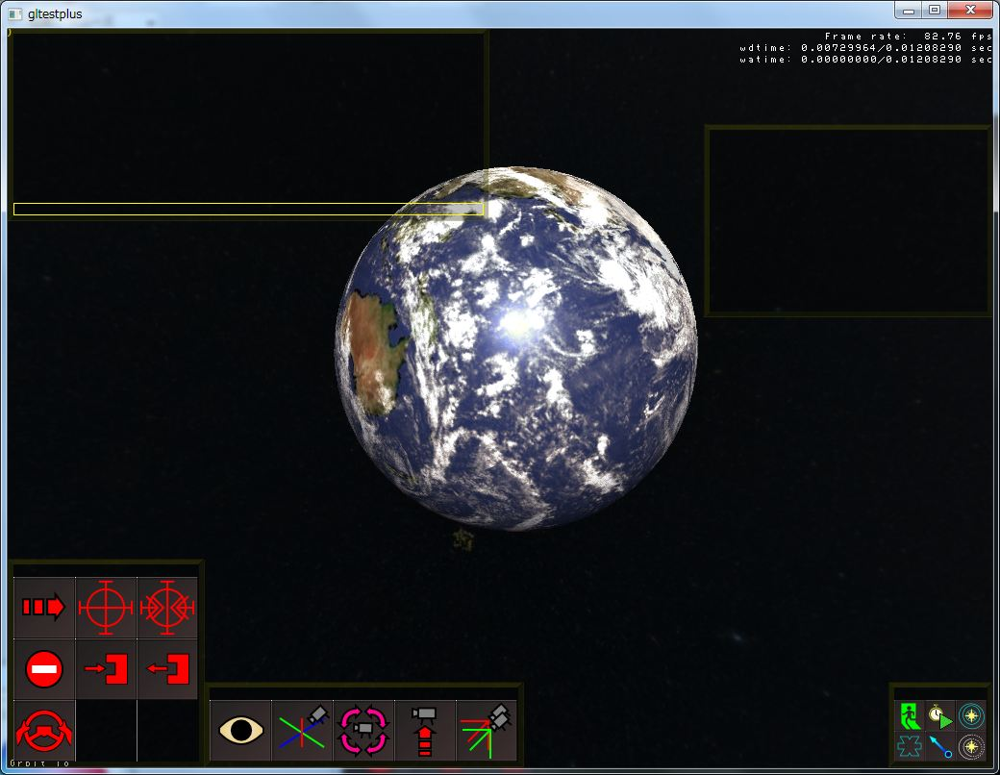
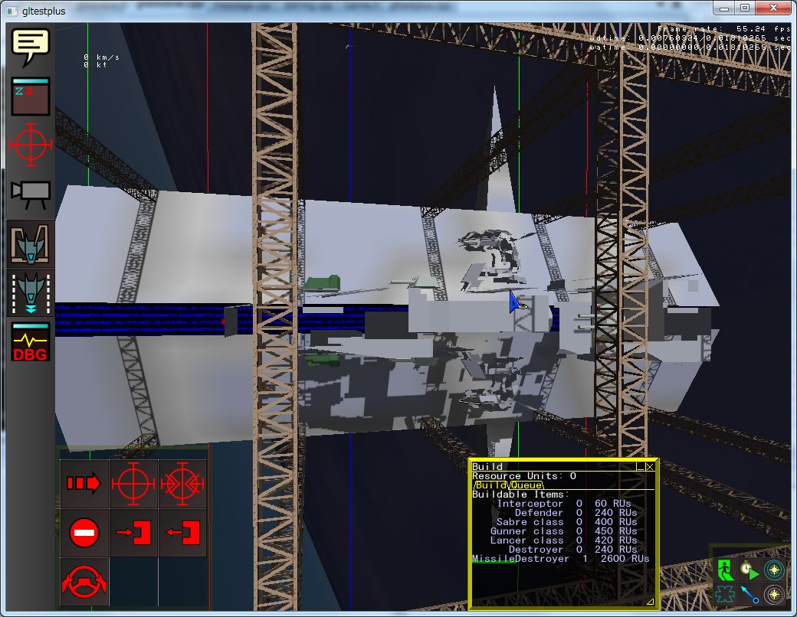
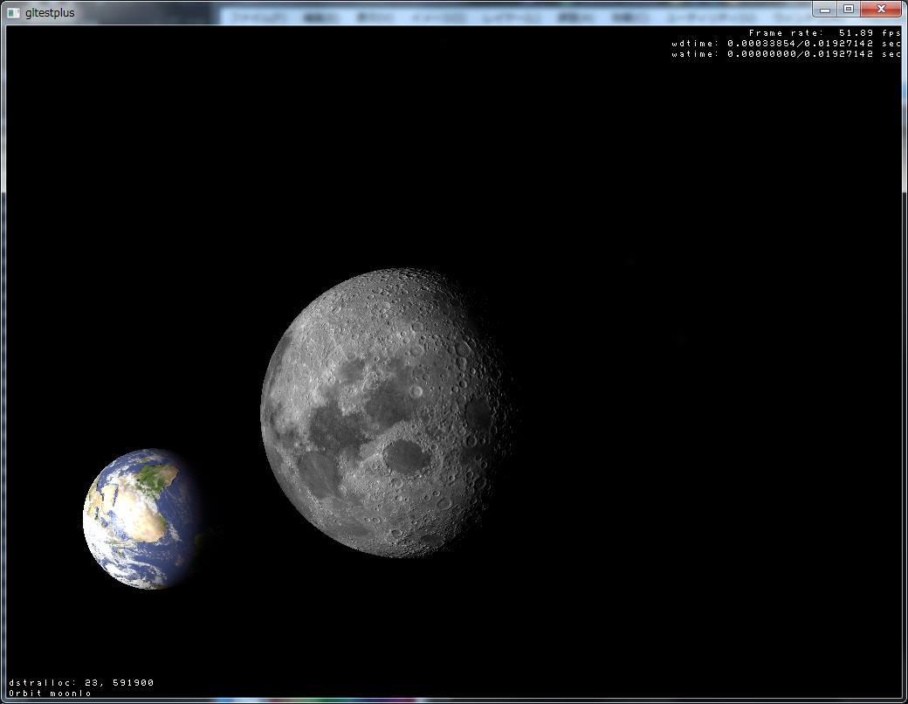

VastSpace Readme
================

** This document is a draft.

What's this?
------------

VastSpace is a 3-D realtime strategy game engine that I have
been developing to test ideas I wanted to try.

Features
--------

* OpenGL-rendered universe including space stations, planets,
  stars and volumetric galaxies.
* Network games over TCP/IP in server-client model (in progress).
* Embedded scripting language for extensive modification.
* Dynamically linked MOD framework.
* HDR enabled for realistic level of lighting.
* Ships can hyperdrive to several lightyears distant solar systems.

Screenshots
-----------

Supported platforms
-------------------

Windows client is tested in Windows 7/8, probably work in Vista too.
You'll need decent graphic boards that support OpenGL.
Tested boards are Radeon HD6870, nVidia GeForce GT 650M.

Linux server must be able to build on most distributions.
Fedora 8 is tested.

Building Windows Client
-----------------------

All dependent libraries except Bullet Dynamics Engine are
included in this repository as source files.

Run svn-bullet.bat BEFORE opening a Visual Studio solution file.
You need a Subversion client installed on your computer
in order to run the batch file.

Since this project uses C++11 features extensively,
supported target versions of Visual Studio are currently only
2012 (Express).

With Visual Studio 2012, you will need to manually change
platform toolset to "Visual Stuido 2012 (v110)" in the IDE
property page.  This is because premake4 does not support
VS2012 yet.

You may need WTL (Windows Template Library) if you want to
build the motion editor.

Building Linux Server
---------------------

Linux server is a network server that can host game worlds
to share among clients.  The server hosted on Linux is called
dedicated server and does not provide any graphics on the
server side.  The server can be managed while running by
command-line interface.

Invoking gnu make will build the application.
Gcc and g++ with C++11 support is needed.
Gcc 4.8.2 is confirmed to build to some extent.
Most distributions doesn't provide package managers that
support gcc 4.8.2 but older versions.  In such case
(which is almost always the case), you must build gcc
from source.

You'll need various external libraries:

* libpng
* The IJG's JPEG library (version 7 or later)
* zlib
* Bullet Dynamics Engine (version 2.76 or later)
* Squirrel Scripting Language version 3
* libogg
* libvorbis

All sources are included in the source tree except Bullet,
but GNUMakefile does not automatically build them.
You can choose the method to install these libraries; You can
install from the distribution's package managers (yum or apt-get)
or build from the sources.

Bullet Dynamics Engine's sources can be downloaded by the shell script
svn-bullet.sh.  A Subversion command line client and internet connection
is required.  BDE libraries are built as shared libraries because the
extension libraries can link to them.  The easiest way to incorporate
BDE is to install it into the system, but if you have no system
administrative privileges, you can set LD_LIBRARY_PATH environment
variable to point to the libraries under your home directory when
running the server.

Notes about history
-------------------

I had been tracking history of the project with Subversion for long time,
so you may see remnants of that age in places.

It took 1200 commits to become confident that Git is worth migrating from
Subversion.

The first part of this software was written in 2004 and it was named Gltest,
because that project's purpose is to test OpenGL features.
As I added various ideas to that project, I end up thinking that creating
a fully simulated space war game is great.
Several years later, I switched the main language for the project to C++
from plain C.  The project's name was changed to Gltestplus at that time.
Subversion history starts since that time.
