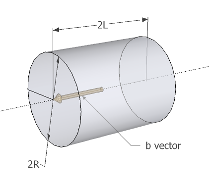

[日本語](jHitCylinder-ja.html)

# Overview

The jHitCylinder function checks if a ray of light is blocked by a cylinder in 3-D space,
just like [jHitSphere](jHitSphere.html).

This function is used relatively less frequently.
It's used to create complex hit shapes in conjunction with jHitSphere and [jHitBox](jHitBox.html).

I have been forgotten the rationale of jHitSphere, so this time I would write it in advance to implement.

# Rationale

Suppose we've got an axis vector $\vec{b}$, who has a length of $L$.
It's a vector indicating axis of the cylinder and normal vector of planes at both ends of the cylinder.
The length of the axis vector indicates half-length of the cylinder.

The cylinder's radius is written as $R$.

The following figure illustrates those variables.
Note that $2R$ is the diameter and $2L$ is the total length of the cylinder.

## Solving intersecting points between the ray and the planes at both ends of the cylinder

The first thing we can obtain is the vector equation representation of the planes.

$$
(\vec{r} \pm \vec{b}) \cdot \vec{b} = 0
$$

And we have the ray's representation in vector equation:

$$
\vec{r}=\vec{a}+t\vec{d}
$$

Substituting the $\vec{r}$ yields the following equation:

$$(\vec{a} + t\vec{d} \pm \vec{b}) \cdot \vec{b} = 0$$

This equation can be solved about $t$ like below.

$$t = \frac{(\vec{a} \pm \vec{b}) \cdot \vec{b}}{\vec{d} \cdot \vec{b}}$$

Substituting this $t$ to the ray's vector equation gives us the position of the point that the ray and the planes intersects,
thus we can know if it really hits cylinder's ends by measuring distance between the points and the cylinder's axis.

## Solving intersecting points between the ray and the cylinder's side

Solving cylinder's side is much like sphere.
We just project the ray to the plane perpendicular to cylinder's axis and do the same thing as in jHitSphere.

First, we define normalized cylinder's axis vector $\hat{b} \equiv \vec{b}/\vert \vec{b}\vert $.

Let's have some vectors projected onto plane perpendicular to cylinder axis.

$$\vec{r_0'} \equiv \vec{r_0} - (\vec{r_0} \cdot \hat{b}) \hat{b}$$

$$\vec{d'} \equiv \vec{d} - (\vec{d} \cdot \hat{b}) \hat{b}$$

The same argument as jHitSphere results in following solution.

$$t=\frac{-\vec{r_0'}\cdot\vec{d'}\pm\sqrt{(\vec{r_0'}\cdot\vec{d'})^2-\vert \vec{d'}\vert ^2(\vert \vec{r_0'}\vert ^2-R^2)}}{\vert \vec{d'}\vert ^2}$$

By substituting this $t$ to the vector equation of the ray and measuring distance along axis, we can tell whether this $t$
indicates intersection with the cylinder.

Also note that if the discriminant of the solution

$$D=(\vec{r_0'}\cdot\vec{d'})^2-\vert \vec{d'}\vert ^2(\vert \vec{r_0'}\vert ^2-R^2)$$

is less than 0, intersection never occurs, because infinitely extended cylinder and the ray are in relationship like skew lines.

# Isn't it re-inventing wheels?

Usually you should use external libraries for this sort of things, because libraries are naturally more tested and robust than home-made algorithms.

We already have Bullet dynamics engine's ray test algorithm, which supports not only hit judgement with boxes, spheres and cylinders,
but also variety of shapes including arbitrary convex polygon.
The problem with Bullet is that it's not reliable, by an unclear reason, to determine if a flying bullet hits objects.
It may be something to do with collision margins, but I'm not sure since I have not gone deep into internals of Bullet dynamics engine.
