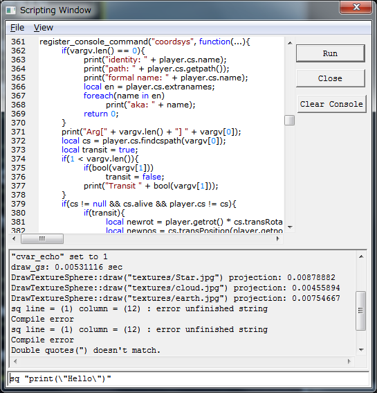

Sqscripter
==========

Sqscripter is a super-simple code editing GUI window designed for embedded scripting languages.
It is suitable for interacting with simulated game world.
It is made by extending [Scintilla](http://www.scintilla.org/) text editing component.

I wanted to use it for [Squirrel](http://www.squirrel-lang.org/) language, so this project is
named Sqscripter, but it could be also used for other languages.

Supported Platform
------------------

Currently, it only works on Windows.
It uses Windows 32bit API, so it would not be possible to port to other OSes without
much effort.

Project files are only provided for Microsoft Visual Studio 2012 (Express), but
it could be built with any compiler that are supported by Scintilla.

Features
--------

These features are almost Scintilla's feature.

* Syntax highlighting

* Switchable line number display

* Switchable white space visualization

* Compile / runtime error indication per line

* Log window which records responses from the application

Log window content is appended by the application's call to
printProc.

* One-line command text edit

Command issued by enter key, interpreted by callback.
Command history can be recalled by up/down arrow keys.

How to Use
----------

The solution file under VC2012 directory will build SciLexer.dll (Scintilla edit component
with customized scripting window) and a test project.

The source file named sqscripter-test.cpp demonstrates how to use this library.

TO DO
-----

* Breakpoints

* Run on separate thread

If we break the main thread's execution by a breakpoint, we'd need another thread to debug.

* Stack frame inspection
